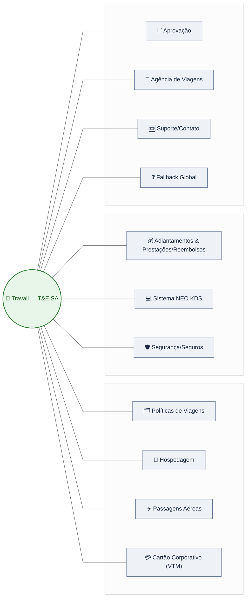

# 2️⃣ Modelo – Arquitetura Conversacional do Chatbot (Travall)


## 2.1 Mapa Geral de Tópicos e Intents




# 2.2 Catálogo de Intents/Tópicos

<details>
<summary><strong>1. Políticas de Viagens (RF01)</strong></summary>

- **Descrição:** Consultar normas e regras de conformidade  
- **Utterances:** “Essa despesa está na norma?”  
- **Slots/Filtros:** Palavra‑chave / norma  
- **Ação/Conector:** Consulta KB (SharePoint)  
- **Prioridade:** Essencial  

</details>

---

<details>
<summary><strong>2. Hospedagem Nacional (RF02)</strong></summary>

- **Descrição:** Orientações para hospedagem nacional  
- **Utterances:** “Como solicitar minha hospedagem no Brasil?”  
- **Slots/Filtros:** Destino / cidade  
- **Ação/Conector:** Consulta KB  
- **Prioridade:** Essencial  

</details>

---

<details>
<summary><strong>3. Passagem Aérea Nacional (RF03)</strong></summary>

- **Descrição:** Orientações para passagem aérea nacional  
- **Utterances:** “Como solicitar voo doméstico?”  
- **Slots/Filtros:** Origem / destino  
- **Ação/Conector:** Consulta KB  
- **Prioridade:** Essencial  

</details>

---

<details>
<summary><strong>4. Hospedagem Internacional (RF04)</strong></summary>

- **Descrição:** Orientações sobre hospedagem internacional  
- **Utterances:** “Como solicitar minha hospedagem no exterior?”  
- **Slots/Filtros:** País / cidade  
- **Ação/Conector:** Consulta KB  
- **Prioridade:** Essencial  

</details>

---

<details>
<summary><strong>5. Passagem Aérea Internacional (RF05)</strong></summary>

- **Descrição:** Orientações para passagem internacional  
- **Utterances:** “Preciso reservar um voo para o exterior”  
- **Slots/Filtros:** País / cidade  
- **Ação/Conector:** Consulta KB  
- **Prioridade:** Essencial  

</details>

---

<details>
<summary><strong>6. Cartão VTM (RF06)</strong></summary>

- **Descrição:** Solicitação e uso do cartão VTM  
- **Utterances:** “Como funciona o VTM?”  
- **Slots/Filtros:** —  
- **Ação/Conector:** Consulta KB  
- **Prioridade:** Desejável  

</details>

---

<details>
<summary><strong>7. Prestação Nacional (RF07)</strong></summary>

- **Descrição:** Como prestar contas de viagens nacionais  
- **Utterances:** “Como prestar contas?”  
- **Slots/Filtros:** Tipo de viagem  
- **Ação/Conector:** Consulta KB  
- **Prioridade:** Essencial  

</details>

---

<details>
<summary><strong>8. Prestação Internacional c/ VTM (RF08)</strong></summary>

- **Descrição:** Prestar contas em viagem internacional usando VTM  
- **Utterances:** “Usei VTM para as despesas, e agora?”  
- **Slots/Filtros:** VTM = Sim  
- **Ação/Conector:** Consulta KB  
- **Prioridade:** Essencial  

</details>

---

<details>
<summary><strong>9. Prestação Internacional s/ VTM (RF09)</strong></summary>

- **Descrição:** Prestar contas em viagem internacional sem VTM  
- **Utterances:** “Usei meu cartão pessoal, como declarar?”  
- **Slots/Filtros:** VTM = Não  
- **Ação/Conector:** Consulta KB  
- **Prioridade:** Essencial  

</details>

---

<details>
<summary><strong>10. NEO KDS — Acesso e Perfil (RF10)</strong></summary>

- **Descrição:** Como acessar e configurar perfil no NEO KDS  
- **Utterances:** “Não consigo acessar o NEO KDS”  
- **Slots/Filtros:** Tipo de acesso  
- **Ação/Conector:** Consulta KB  
- **Prioridade:** Essencial  

</details>

---

<details>
<summary><strong>11. NEO KDS — Erros e Troubleshooting (RF11)</strong></summary>

- **Descrição:** Solução dos principais erros do sistema  
- **Utterances:** “O NEO KDS está apresentando o erro X...”  
- **Slots/Filtros:** Código / descrição do erro  
- **Ação/Conector:** Consulta KB  
- **Prioridade:** Essencial  

</details>

---

<details>
<summary><strong>12. Adiantamento (RF12)</strong></summary>

- **Descrição:** Como solicitar adiantamento  
- **Utterances:** “Prazo para pedir adiantamento?”, “Como solicito?”  
- **Slots/Filtros:** —  
- **Ação/Conector:** Consulta KB  
- **Prioridade:** Essencial  

</details>

---

<details>
<summary><strong>13. Procedimentos Seguros (RF13)</strong></summary>

- **Descrição:** Link para procedimentos seguros de viagem  
- **Utterances:** “Como fazer uma viagem segura?”  
- **Slots/Filtros:** —  
- **Ação/Conector:** Exibir link oficial  
- **Prioridade:** Opcional  

</details>

---

<details>
<summary><strong>14. Formulário de Viagem com Risco (RF14)</strong></summary>

- **Descrição:** Link para formulário de viagens com risco  
- **Utterances:** “Viagem com risco”  
- **Slots/Filtros:** —  
- **Ação/Conector:** Exibir link oficial  
- **Prioridade:** Opcional  

</details>

---

<details>
<summary><strong>15. EBTA — Bilhetes de Seguro (RF15)</strong></summary>

- **Descrição:** Solicitação de bilhetes EBTA  
- **Utterances:** “Seguro/EBTA”  
- **Slots/Filtros:** —  
- **Ação/Conector:** Consulta KB  
- **Prioridade:** Desejável  

</details>

---

<details>
<summary><strong>16. Aprovação (RF16)</strong></summary>

- **Descrição:** Orientações para aprovadores  
- **Utterances:** “Sou o N+1,como aprovo uma viagem ?”  
- **Slots/Filtros:** Tipo (viagem/prestação)  
- **Ação/Conector:** Consulta KB  
- **Prioridade:** Essencial  

</details>

---

<details>
<summary><strong>17. Agência de Viagens — Flytour (RF17)</strong></summary>

- **Descrição:** Informações básicas da agência  
- **Utterances:** “Qual o contato da agência?”  
- **Slots/Filtros:** —  
- **Ação/Conector:** Consulta KB  
- **Prioridade:** Desejável  

</details>

---

<details>
<summary><strong>18. Reembolso — Problemas (RF18)</strong></summary>

- **Descrição:** Orientações para problemas de reembolso  
- **Utterances:** “Meu reembolso não caiu”  
- **Slots/Filtros:** Tipo de problema  
- **Ação/Conector:** Consulta KB  
- **Prioridade:** Essencial  

</details>

---

<details>
<summary><strong>19. Contato T&E (RF19)</strong></summary>

- **Descrição:** Exibir e‑mail de contato da equipe de T&E  
- **Utterances:** “Falar com agência de viagens”  
- **Slots/Filtros:** Motivo (opcional)  
- **Ação/Conector:** Exibir e-mail / Fluxo Power Automate  
- **Prioridade:** Essencial  

</details>

---

<details>
<summary><strong>20. Hotéis / Diárias / Parcerias (RF20)</strong></summary>

- **Descrição:** Hotéis parceiros e limites por localidade  
- **Utterances:** “Limite de diária em X?”  
- **Slots/Filtros:** Localidade  
- **Ação/Conector:** Consulta KB  
- **Prioridade:** Opcional  

</details>

---

<details>
<summary><strong>21. Aluguel de Carro (RF21)</strong></summary>

- **Descrição:** Diretrizes para aluguel nacional e internacional  
- **Utterances:** “Posso alugar carro?”  
- **Slots/Filtros:** Tipo de viagem  
- **Ação/Conector:** Consulta KB  
- **Prioridade:** Desejável  

</details>
 
## 2.2.2 Matriz de Transição entre Tópicos

```mermaid
graph LR
  POLITICA["📄 Políticas"] -- "Como faço no sistema?" --> NEOKDS["💻 NEO KDS"]
  NEOKDS -- "Depois de fazer no sistema..." --> PRESTACAO["💰 Prestação/Adiantamento"]
  PRESTACAO -- "Quais regras/limites?" --> POLITICA
  ANY["Qualquer Tópico"] -- "3+ fallbacks / frustração" --> CONTATO["📧 Contato T&E / Abrir chamado"]
  style CONTATO fill:#FFCDD2,stroke:#C62828
  ```

## 2.3 Fluxo por Intent


```mermaid
graph TD
  START["🟢 **Trigger** – Intent reconhecida"] --> AUTH_CHECK{"🔐 Requer autenticação?"}
  AUTH_CHECK -- "Sim" --> AUTH["Verificar SSO/Token – Microsoft Entra ID"]
  AUTH_CHECK -- "Não" --> QUERY_KB
  AUTH -->|OK| QUERY_KB["🔎 Consultar KB (SharePoint) • Regras/Manuais"]
  AUTH -->|Falha| AUTH_ERR["⚠️ Erro de autenticação • Solicitar login"]
  QUERY_KB --> RESP{"✅ Resposta encontrada?"}
  RESP -- "Sim" --> SUCCESS["✅ Resposta formatada + citações da fonte"]
  RESP -- "Não" --> FALLBACK["❌ Fallback • Sugerir reformulação"]
  SUCCESS --> END["↩️ Encerrar tópico • 'Posso ajudar em algo mais?'"]
  FALLBACK --> ESCALATE["🆘 Escalonar: Exibir e-mail T&E e/ofertar 'Abrir chamado T&E' (Power Automate)"]
  style START fill:#C8E6C9,stroke:#2E7D32,color:#000
  style QUERY_KB fill:#E3F2FD,stroke:#1565C0,color:#000
  style SUCCESS fill:#C8E6C9,stroke:#2E7D32,color:#000
  style FALLBACK fill:#FFECB3,stroke:#F9A825,color:#000
  style ESCALATE fill:#FFCDD2,stroke:#C62828,color:#000

  ```

  ## 2.4 Comportamento Global do Agente (100% IA Generativa)

  ```mermaid
flowchart TB

    %% ======================
    %% AGENTE
    %% ======================
    A["🤖 Travall\nAgente 100% IA Generativa"]
    %% NATIVOS DO COPILOT STUDIO
    %% ======================
    W["👋 Conversation Start\nBoas-vindas automática"]:::native
    INACT["⏳ Inatividade\nUser is inactive for a while"]:::native


    %% ======================
    %% ORQUESTRADOR GENERATIVO
    %% ======================
    GEN["🧠 Orquestrador Generativo\nUST + KB + Regras"]:::orch
    SAFE["🛡️ Resposta Segura\nFallback generativo"]:::orch
    CTX["📚 Contexto\nÚltimos turnos"]:::orch


    %% ======================
    %% CUSTOMIZÁVEL
    %% ======================
    END["🔚 Encerramento\nOpcional"]:::custom


    %% ======================
    %% FLUXO PRINCIPAL
    %% ======================
    A --> W --> GEN
    GEN --> SAFE
    GEN --> END
    SAFE --> END
    INACT --> END

    %% CONTEXTO SEMPRE ATUALIZADO
    W --> CTX
    GEN --> CTX
    SAFE --> CTX


    %% ======================
    %% ESTILOS
    %% ======================
    classDef native fill:#fffde7,stroke:#f9a825,color:#4e342e,stroke-width:1.3px;
    classDef orch fill:#e3f2fd,stroke:#1565c0,color:#0d47a1,stroke-width:1.3px;
    classDef custom fill:#f3e5f5,stroke:#6a1b9a,color:#4a148c,stroke-width:1.3px;
  
  ```
  ## 2.4.1 Comportamento Global do Agente (Híbrido)


  ```mermaid
   flowchart TB

    %% ======================
    %% AGENTE
    %% ======================
    A["🤖 Travall\nAgente Híbrido\nTopicos + IA Generativa"]
    %% SYSTEM TOPICS NATIVOS
    %% ======================
    W["👋 Conversation Start\nBoas-vindas automática"]:::native
    F1["❓ Fallback\n1a tentativa"]:::native
    F2["❓ Fallback\n2a tentativa"]:::native
    ESC["🆘 Escalate\nApós 2 falhas"]:::native
    INACT["⏳ Inatividade\nUser is inactive for a while"]:::native


    %% ======================
    %% IA GENERATIVA / UST
    %% ======================
    GEN["🤖 IA Generativa\nUST + KB"]:::orch
    CTX["📚 Contexto\nÚltimos turnos"]:::orch


    %% ======================
    %% CUSTOMIZÁVEL
    %% ======================
    END_OK["✅ Encerramento\nFim de tópico"]:::custom
    END_ESC["🔚 Encerramento\nPós-Escalate"]:::custom
    END_INACT["🔚 Encerramento\nPor inatividade"]:::custom


    %% ======================
    %% FLUXO PRINCIPAL
    %% ======================

    %% INÍCIO
    A --> W --> GEN

    %% FALLBACK TRADICIONAL
    A --> F1 --> F2 --> ESC --> END_ESC

    %% RESPOSTA COM SUCESSO VIA IA
    GEN --> END_OK

    %% INATIVIDADE
    INACT --> END_INACT

    %% CONTEXTO SEMPRE ACIONADO
    W --> CTX
    F1 --> CTX
    F2 --> CTX
    ESC --> CTX
    GEN --> CTX


    %% ======================
    %% ESTILOS
    %% ======================
    classDef native fill:#fffde7,stroke:#f9a825,color:#4e342e,stroke-width:1.3px;
    classDef orch fill:#e3f2fd,stroke:#1565c0,color:#0d47a1,stroke-width:1.3px;
    classDef custom fill:#f3e5f5,stroke:#6a1b9a,color:#4a148c,stroke-width:1.3px;

  ```

  ## 2.4.2 Tabela de Transições
## Tabela de Transições

| De                     | Para        | Condição / Trigger                     | Ação                                                   |
|------------------------|-------------|-----------------------------------------|--------------------------------------------------------|
| Políticas              | NEO KDS     | Usuário pergunta “como fazer no sistema” | Exibir passo a passo / guia NEO KDS                    |
| Adiantamento / Prestação | Políticas | Usuário pede regras / limites           | Exibir regra da Política                               |
| Qualquer Tópico        | Contato T&E | 3+ fallbacks ou frustração              | Encerrar IA generativa e exibir contato / abrir chamado |


## 2.5 Diretrizes de Conteúdo da Resposta (Formatação)

| Diretriz | Descrição |
|---------|-----------|
| **Citar fontes** | Sempre indicar o documento da KB, manual ou política utilizada como base. |
| **Passo a passo + links** | Fornecer instruções numeradas e links relevantes para orientar o usuário. |
| **Clareza e call-to-action** | Responder de forma objetiva e oferecer ações adicionais (“Deseja abrir chamado?”). |
| **Conteúdos sensíveis / segurança** | Em casos de risco ou segurança, sempre priorizar links oficiais e materiais validados. |


  
  
