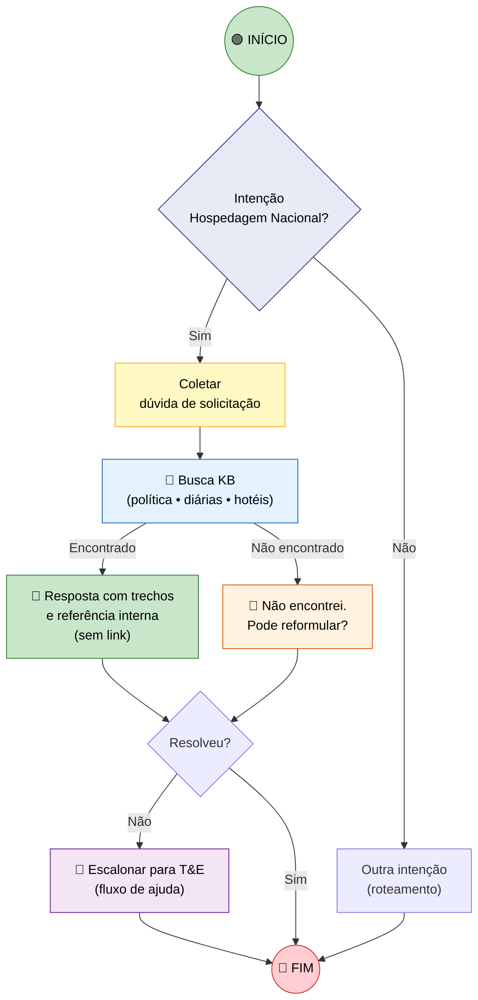
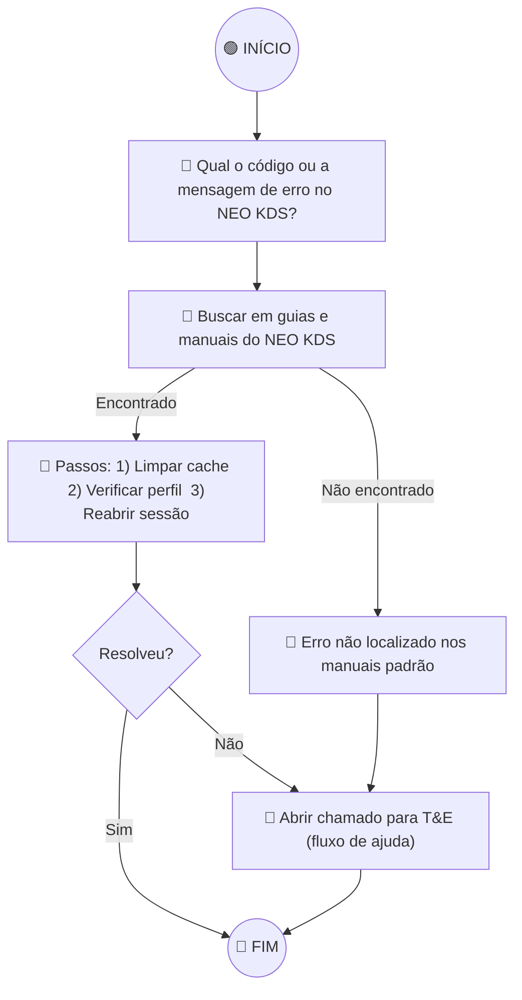

# 4️⃣ Design de Fluxo Conversacional

## 4.2 Template de Fluxo (Canvas Padronizado)

### 🔷 Cabeçalho do Fluxo

| Campo | Valor |
|---|---|
| **Nome do Fluxo** | `[PREENCHER]` *Ex: “Hospedagem – Solicitação Nacional”* |
| **Objetivo de Negócio** | `[PREENCHER]` *Ex: “Orientar a solicitação de hospedagem nacional conforme a política de viagens.”*  |
| **RF/RNF Atendidos** | `[RFxx, RFyy, RNF01, RNF02, RNF03…]`  |
| **Owner (Área/Responsável)** | `Equipe T&E SA` |
| **Prioridade** | `Alta / Média / Baixa` |
| **Requer Autenticação?** | `Sim – Microsoft Entra ID (SSO)` |
| **Canais Suportados** | `Teams (SA)` *(Web opcional)* |
| **Idiomas** | `PT-BR (primário); EN; ES` *(RNF01)*  |
| **Escopo** | `Informativo. Sem integrações transacionais/ações no NEO KDS.`  |
| **Observabilidade** | `Telemetria e auditoria (uso, erros, mapeamento intents); trilhas de auditoria admin` *(RNF07)* |

### 🔷 Triggers (Gatilhos de Entrada)

| Campo | Descrição | Exemplo |
|---|---|---|
| **Tipo de Trigger** | Como o fluxo é acionado | `Mensagem livre` / `NLU intent` |
| **Utterances/Keywords** | Frases que disparam o fluxo | *“reservar hotel nacional”, “hospedagem Brasil”, “hotel SP diária”* |
| **Condições de Entrada** | Pré-requisitos | `Usuário autenticado (SSO)` / `Perfil T&E válido` [1](https://vallourec-my.sharepoint.com/personal/gabriel_andrade_vallourec_com/Documents/Arquivos%20de%20Microsoft%20Copilot%20Chat/chatbot-especificacao-principal.pdf) |

### 🔷 Variáveis / Slots

| # | Nome | Tipo | Obrigatório? | Pergunta ao Usuário | Validação | Exemplo |
|---|---|---|:--:|---|---|---|
| 1 | `localidade` | Texto | Sim | “Para onde é a viagem?” | Não vazio | “Belo Horizonte/MG” |
| 2 | `data_inicio` | Data | Sim | “Qual a data de início?” | ISO-8601 | `2026-04-15` |
| 3 | `data_fim` | Data | Sim | “Qual a data de término?” | >= início | `2026-04-17` |
| 4 | `duvida_especifica` | Texto | Não | “Há algum detalhe adicional?” | — | “Política de diária em SP” |

### 🔷 Passos do Fluxo (Guided + Generative QA)

1. **Entender a intenção** (NLU) e **confirmar escopo informativo**; aplicar **filtros de conteúdo/RAI** e **DLP por ambiente**. *(RNF03, RNF04, RNF06)* 
2. **Coletar slots** mínimos (localidade, datas, etc.).  
3. **Pesquisar na Base de Conhecimento** (SharePoint/arquivos permitidos) e **gerar resposta citando fonte interna**.  
4. **Validar compreensão** do usuário; oferecer **link/artefato oficial** quando aplicável. *(RFs conforme fluxo)*
5. **Fallback**: se não encontrado → oferecer **reformulação**; se persistir, **escalonar via Power Automate** para T&E com contexto mínimo (usuário, tema, mensagem, prints). *(RF19)* 
6. **Encerramento**: perguntar se há algo mais; **survey** curto de utilidade/clareza.

### 🔷 Erros, Fallback & Escalonamento

- **Fallback 1–2x**: “Não encontrei. Pode reformular ou dar mais detalhes?”  
- **Frustração (≥3x)**: **Escalonar** (fluxo Power Automate) com orientação: “Enviei seu pedido à equipe T&E; você receberá retorno por e-mail.” *(RF19)* 

### 🔷 Regras Globais (por Fluxo)

- **Sem transações** (informativo apenas). 
- **Idiomas**: respostas principais em PT-BR; fallback multilíngue (EN/ES quando detectado). *(RNF01)* 
- **Desempenho alvo**: latência ≤ 3–5s (sem conectores); P95 ≤ 7–10s (com fluxos). *(RNF05)* 
- **Disponibilidade**: ≥ 99,9% mensal (Teams/Web). *(RNF08)* 

---

## 4.3 Exemplo Preenchido – “Hospedagem – Solicitação Nacional” (RF02)

**Cabeçalho (resumo):**  
- **RF/RNF**: RF02, RF01 (política referenciada), RNF01, RNF02, RNF03, RNF04, RNF05, RNF06, RNF07, RNF08. 
- **Escopo**: orientar, indicar links oficiais e limites/diárias; **sem reservar** ou acionar sistemas externos. 

## 4.4 Exemplo Preenchido – “NEO KDS – Troubleshooting (Erros Comuns)” (RF11)

## 4.5 Visão Consolidada- Mapa de Roteamento (Todos os Fluxos)

```mermaid
graph TD
  ENTRY(("👤 Usuário inicia conversa (Teams)"))
  ENTRY --> WELCOME["👋 Boas-vindas (PT/EN/ES)"]
  WELCOME --> NLU{"🧠 NLU - Intent"}

  NLU -->|Política/Compliance| F01["📄 Política de Viagens (RF01)"]
  NLU -->|Hospedagem - BR| F02["🏨 Hospedagem Nacional (RF02)"]
  NLU -->|Aérea - BR| F03["✈️ Passagem Nacional (RF03)"]
  NLU -->|Hospedagem - Intl| F04["🌍 Hospedagem Internacional (RF04)"]
  NLU -->|Aérea - Intl| F05["🛫 Passagem Internacional (RF05)"]
  NLU -->|Cartão| F06["💳 VTM (RF06)"]
  NLU -->|Prestação - BR| F07["🧾 Prestação Nacional (RF07)"]
  NLU -->|Prestação - Intl c/ VTM| F08["🧾 Intl com VTM (RF08)"]
  NLU -->|Prestação - Intl s/ VTM| F09["🧾 Intl sem VTM (RF09)"]
  NLU -->|NEO - Acesso/Perfil| F10["🖥️ NEO Acesso/Perfil (RF10)"]
  NLU -->|NEO - Erros| F11["🧰 NEO Troubleshooting (RF11)"]
  NLU -->|Adiantamento| F12["💰 Adiantamento (RF12)"]
  NLU -->|Viagem Segura| F13["🛡️ Procedimentos (RF13)"]
  NLU -->|Viagem com Risco| F14["⚠️ Formulário (RF14)"]
  NLU -->|Seguros EBTA| F15["🧷 EBTA (RF15)"]
  NLU -->|Aprovadores| F16["✔️ Aprovação (RF16)"]
  NLU -->|Agência Flytour| F17["🏢 Flytour (RF17)"]
  NLU -->|Reembolso| F18["💵 Problemas Reembolso (RF18)"]
  NLU -->|Contato T&E| F19["🆘 Escalonamento (RF19)"]
  NLU -->|Hotéis/Diárias| F20["🏨 Parceiros & Limites (RF20)"]
  NLU -->|Aluguel Carro| F21["🚗 Diretrizes (RF21)"]

  NLU -->|Não reconhecido| FB["❓ Fallback Global: 'Pode reformular?'"]
  FB -->|1–2x| NLU
  FB -->|≥3x| F19

  click F19 "Power Automate: abrir chamado" "blank"

  style ENTRY fill:#C8E6C9,stroke:#2E7D32,color:#000
  style WELCOME fill:#E8EAF6,stroke:#283593,color:#000
  style NLU fill:#E8EAF6,stroke:#283593,color:#000
  style FB fill:#FFF9C4,stroke:#F9A825,color:#000
```

